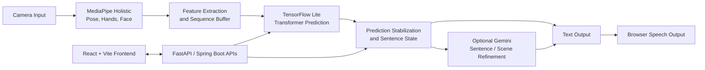

<h1 align="center">SignBridge</h1>

<p align="center">
  <strong>Bridging Communication Gaps with Real-Time Sign Language Translation &amp; Machine Learning.</strong>
</p>

<p align="center">
  <a href="https://signbridge-frontend-389644353290.us-central1.run.app/#overview">🚀 Launch the SignBridge Live Demo</a>
</p>

<p align="center">
  <a href="https://github.com/AbhiramAmaravadi/signbridge/blob/main/LICENSE"></a>
  <a href="https://www.python.org/"></a>
  <a href="https://github.com/AbhiramAmaravadi/signbridge"></a>
  <a href="https://github.com/AbhiramAmaravadi/signbridge/actions"></a>
  <a href="https://youtu.be/WMk-TVJiK8Q"></a>
</p>

## Overview

SignBridge is a modular, real-time sign language recognition and translation platform. It captures video, extracts body/hand/face landmarks, classifies temporal gesture sequences, assembles recognized signs into sentences, and optionally uses Gemini for natural-language refinement and scene-aware translation.

Try the deployed application: [SignBridge Live Demo](https://signbridge-frontend-389644353290.us-central1.run.app/#overview).

The repository is organized as three cooperating applications:

```text
SignBridge/
├── frontend/          React 19 + Vite web application
├── backend/            Java 21 + Spring Boot API and translation history
├── ai-service/         Python FastAPI + MediaPipe + TensorFlow Lite inference service
├── sign_classifier/    Transformer-based TFLite sign model and evaluation tools
├── emotion_classifier/ TFLite emotion model used by the AI service
└── docs/               Architecture and API notes
```

## Explanation Video

<p align="center">
  <a href="https://youtu.be/WMk-TVJiK8Q"></a>
</p>

The video covers the system architecture, machine-learning pipeline, and a live demonstration of SignBridge.

## Key Features

- **Real-time gesture recognition:** Processes webcam frames with MediaPipe Holistic landmark detection and a temporal TensorFlow Lite classifier.
- **Multi-modal translation:** Converts `video → landmarks → gestures → text`, with optional text-to-speech and Gemini-assisted sentence refinement.
- **Low-latency local inference:** The core landmark and sign-classification path runs locally and supports CPU execution.
- **Modular services:** Use the browser UI, the FastAPI inference service, or the model utilities independently.
- **Stateful sentence assembly:** Stabilizes predictions, tracks words, detects completion, and finalizes sentences.
- **Extensible platform:** Designed for new signs, additional languages, mobile clients, and alternative model runtimes.

## Architecture



The classifier consumes landmark sequences in the project’s training order and predicts 250 ASL sign classes. The documented held-out validation results are 67.25% top-1 accuracy and 87.57% top-5 accuracy; see [`sign_classifier/README.md`](sign_classifier/README.md) for model details.

## Technology Stack

| Layer | Technologies |
| --- | --- |
| Web client | React 19, TypeScript, Vite, Axios, Framer Motion |
| AI service | Python 3.11+, FastAPI, Uvicorn, OpenCV, MediaPipe, NumPy |
| ML inference | TensorFlow Lite, Transformer encoder model, MediaPipe Holistic landmarks |
| Application API | Java 21, Spring Boot 4.1, Spring Web MVC, Spring Data JPA |
| Persistence | PostgreSQL |
| Generative and speech capabilities | Gemini API, Google Cloud Text-to-Speech, browser Web Speech API |

## Getting Started

### Prerequisites

- Python 3.11 recommended for the AI service
- Node.js 20+ and npm for the frontend
- Java 21 for the Spring Boot backend
- PostgreSQL for translation history and backend database features
- A webcam for live recognition
- CUDA is **optional**. CPU inference is supported; if you enable GPU acceleration, install a TensorFlow runtime and CUDA/cuDNN combination supported by your target platform.

### 1. Clone the repository

```bash
git clone https://github.com/AbhiramAmaravadi/signbridge.git
cd signbridge
```

### 2. Install the AI service

```bash
cd ai-service
python -m venv venv

# macOS/Linux
source venv/bin/activate

# Windows PowerShell
# .\\venv\\Scripts\\Activate.ps1

python -m pip install --upgrade pip
pip install -r requirements.txt
cd ..
```

### 3. Configure PostgreSQL

Create the database used by the Spring Boot backend:

```sql
CREATE DATABASE signbridge;
```

The development defaults are defined in [`backend/src/main/resources/application.properties`](backend/src/main/resources/application.properties):

```text
Host: localhost
Port: 5432
Database: signbridge
Username: postgres
Password: 1234
```

For shared or production environments, override these values through your normal Spring configuration mechanism and do not commit credentials.

### 4. Start the services

Run each service in its own terminal.

**AI service — FastAPI inference API**

```bash
cd ai-service

# Activate the virtual environment first if it is not active.
uvicorn app_server:app --host 127.0.0.1 --port 8001 --reload
```

**Spring Boot backend**

```bash
cd backend
./mvnw spring-boot:run

# Windows PowerShell: .\\mvnw.cmd spring-boot:run
```

**React frontend**

```bash
cd frontend
npm install
npm run dev
```

Open the Vite URL shown in the terminal, usually `http://127.0.0.1:5173`.

### Optional: local OpenCV webcam demo

The desktop demo runs landmark extraction and saves rolling sequences locally:

```bash
cd ai-service
python main.py --camera-index 0 --width 640 --height 480 --sequence-length 30
```

Press `q` to exit. Useful options include `--output-dir`, `--save-stride`, `--model-complexity`, `--min-detection-confidence`, and `--min-tracking-confidence`.

## Configuration

### Frontend API target

The frontend uses `VITE_API_BASE_URL` when set; otherwise it uses the configured deployment URL in [`frontend/src/config.ts`](frontend/src/config.ts).

```bash
cd frontend
printf "VITE_API_BASE_URL=http://127.0.0.1:8001\n" > .env.local
npm run dev
```

For PowerShell:

```powershell
$env:VITE_API_BASE_URL = "http://127.0.0.1:8001"
npm run dev
```

### Gemini integration

Gemini is optional. Without a key, the AI service uses a safe local fallback for sentence and scene operations.

```bash
export GEMINI_API_KEY="your_api_key_here"
export GEMINI_MODEL="gemini-2.5-flash"
```

PowerShell:

```powershell
$env:GEMINI_API_KEY = "your_api_key_here"
$env:GEMINI_MODEL = "gemini-2.5-flash"
```

## API Reference

The FastAPI service provides interactive OpenAPI documentation at `http://127.0.0.1:8001/docs`.

| Method | Endpoint | Purpose |
| --- | --- | --- |
| `GET` | `/health` | AI service health check |
| `POST` | `/predict` or `/api/v1/inference` | Predict signs from landmarks or a base64 image frame |
| `POST` | `/api/v1/sentence/finalize` | Finalize the current sentence |
| `POST` | `/api/v1/sentence/reset` | Reset sentence state |
| `POST` | `/api/v1/sentence/append` | Append a word manually |
| `POST` | `/api/v1/sentence/delete` | Delete a word manually |
| `POST` | `/api/v1/gemini/translate` | Refine recognized words into natural language |
| `POST` | `/api/v1/gemini/scene` | Analyze an image scene when Gemini is enabled |
| `GET` | `/api/v1/gemini/scene-prompt` | Inspect the scene-analysis prompt |

Example inference request using a landmark sequence:

```bash
curl -X POST http://127.0.0.1:8001/api/v1/inference \\
  -H "Content-Type: application/json" \\
  -d '{"landmarks": [[[0.0, 0.0, 0.0]]], "top_k": 5}'
```

The Spring Boot service is available at `http://127.0.0.1:8080` and exposes `/health`, `/api/v1/recognize`, `/api/v1/translate`, and translation history routes under `/api/v1/translations`.

## Model Evaluation

Run the classifier benchmark from the repository root:

```bash
python sign_classifier/benchmark.py --samples 500 --shuffle
```

See [`sign_classifier/README.md`](sign_classifier/README.md) for preprocessing, the 250-class output space, and evaluation methodology.

## Roadmap

- [x] Real-time MediaPipe landmark extraction
- [x] TensorFlow Lite temporal sign classification
- [x] FastAPI inference and sentence-state endpoints
- [x] React/Vite browser interface
- [x] Optional Gemini sentence refinement and scene context
- [ ] Expand sign coverage and multilingual sign-language support
- [ ] Fine-tune and continuously evaluate models on broader, representative datasets
- [ ] Add mobile deployment targets and optimized on-device inference
- [ ] Add automated CI, API contract tests, and release artifacts
- [ ] Improve observability, calibration, and accessibility testing

## Contributing

Contributions are welcome. To propose a change:

1. Open an issue describing the problem, use case, or proposed design.
2. Fork the repository and create a focused branch.
3. Keep changes scoped, documented, and covered by tests where practical.
4. Run the relevant frontend lint/build, backend tests, and AI-service checks.
5. Open a pull request with a clear summary, validation steps, and screenshots for UI changes.

Please do not include API keys, database passwords, user video, or other sensitive data in commits or issue attachments. When reporting model behavior, include reproducible context and label the result as an observation rather than a guarantee of recognition accuracy.

## License

SignBridge is intended to be released under the [MIT License](LICENSE). If you are packaging or redistributing this repository, verify that the repository’s `LICENSE` file is present and reflects the applicable licensing terms.

## Acknowledgments

SignBridge builds on the work of the MediaPipe, TensorFlow, OpenCV, FastAPI, React, Spring Boot, and PostgreSQL communities. We also acknowledge the research and dataset contributors whose work enables accessible sign-language machine learning, and the SAIL (Software AI / Accessibility Lab) community for its accessibility-focused collaboration.

<p align="center">
  <sub>Built to make communication more accessible, one gesture at a time.</sub>
</p>
